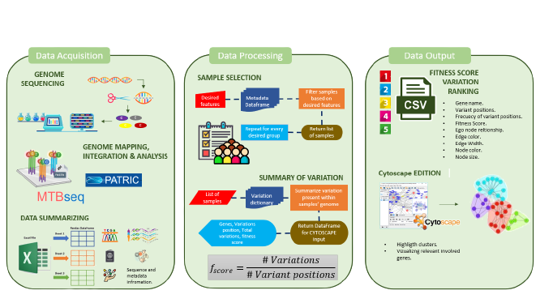

# FUN-TB

'FUN-TB' is a python-based standalone tool for SNPs study comparisons among contrasting phenotypical sets of samples in order to highligth those genes that present alterations and see if they are proper for one or more groups. FunTB takes as input an MTBSeq output file and a CSV format clinical table information. The first script 

## Table of Contents

- [Features](#features)
- [Installation](#installation)
- [Usage](#usage)
- [Documentation](#documentation)
- [Examples](#examples)
- [Contributing](#contributing)
- [License](#license)

<p align="center">
  
</p>

## Features

- Analyze genetic variations related to tuberculosis.
- Construct phenotype-centric networks based on genetic data.
- Visualize and interpret complex relationships between genes and phenotypes.

## Installation

Ensure you have Python 3.x installed on your system. Install MyTool using pip:

```bash
pip install mytool

This tool takes as input three parameters. First, an MTBseq output tab file. Second, a list of samples in txt format that you want to compare and, finally, an integer number representing the number of top genes you want to get from the interest groups. To run this tool, you have to execute the following-like command:

```
FUN-TB.py MTBseq_file.tab samples.txt 1000
```

And as output, we will get a CSV file, an input format for Cytoscape, a network software where we can visualize and edit our resulting genes' relationships. The output format looks like this:

| Source Node  |  Target Node   | Fitness Score | Edge Color | Node Size |
|    :---:     |     :---:      |     :---:     |    :---:   |   :---:   |
|     acee     |   Sensitive    |       7       |    blue    |     5     |
|     rpoc     |   Resistant    |       3       |    green   |     2     |

Once you import the output file in Cytoscape, you can map the different networks' parameters and get the editable format to set some extra settings like node position and distribution, node group based on desired or similar characteristics.  Finally, save your final network image. The workflow of the data processing is as follows:


At the moment, you can find a [Beta version](https://colab.research.google.com/drive/1bttbnmZs682GMH_eq-J7EWxsvm6UBFRW?usp=sharing) implemented in Google Colab, where we have already pre-loaded some Mexican available sequences data and their corresponding metadata information (Geographical, Age, Sex, Comorbidities, Acquisition year, and Drug Resistance status). You can select from a list of options, the characteristics desired for each of the two groups you can compare and get a preliminary network image corresponding to the two groups of interest.

To run this beta, you need, first, to execute the code section; this group of cells contains all the necessary functions to load and process the data to generate the final network.

Then, within the FUN-TB section, you have to choose the characteristics for each of the two groups you want to compare. Once you select those features, run both cells.

Finally, you need to set a total of the top genes (Integer number) you want to consider in the network structure, then run the cell of network construction and, that's it, you will have a preliminary image of your network.

<p align="center">
  
</p>
